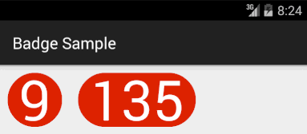

Badge Indicator
===============

A simple, custom drawn, badge view library for Android.

Characteristics: 

 * Be a circle for single digits.
 * Preserve height when value has more than one digit.
 * Allow the use of ColorStateList as badge and text color.
 

 
To try it out, run the included sample app. 
 
Why
===

The drive for this was to experiment with testing custom drawn views. 

This is work in progress... A better way is needed, at least for automated regression testing.

License
=======

    Licensed under the Apache License, Version 2.0 (the "License");
    you may not use this file except in compliance with the License.
    You may obtain a copy of the License at

       http://www.apache.org/licenses/LICENSE-2.0

    Unless required by applicable law or agreed to in writing, software
    distributed under the License is distributed on an "AS IS" BASIS,
    WITHOUT WARRANTIES OR CONDITIONS OF ANY KIND, either express or implied.
    See the License for the specific language governing permissions and
    limitations under the License.

